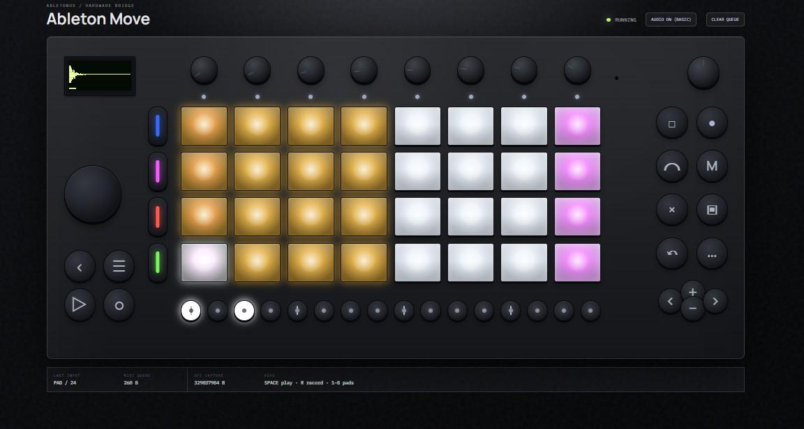

# Ableton Move Lab

Run the Ableton Move software stack with a browser-based control surface.

This repository provides the open tooling around the original Move recovery
image:

- an `LD_PRELOAD` shim for the Move XMOS/SPI hardware boundary;
- a Node.js HTTP API and browser GUI;
- a Docker-based Linux ARM64 container path;
- a Raspberry Pi 4 image preparation path.

It supports two main targets:

- **Container**: run Move locally with Docker and open the GUI at
  `http://localhost:9090`.
- **Raspberry Pi 4**: build a bootable microSD image and open the GUI over the
  Move/Raspberry USB network at `http://172.16.254.1:9090`.

<p align="center">
  
</p>

<p align="center">
  Browser-based Move control surface: display, pads, buttons, LEDs, and audio streaming.
</p>

## What Is This?

Ableton Move Lab lets you run the original Ableton Move software outside the
original hardware shell.

Think of it as taking the Move "brain" and exposing it through a browser-based
control surface.

You can use it to:

- experiment with the Move software stack;
- run it in a Docker/Linux ARM64 container;
- run it natively on a Raspberry Pi 4;
- control display, pads, buttons, LEDs, and audio from a web browser;
- explore custom hardware or alternative controller ideas.

## What Is The Shim?

The original Move software expects to talk to dedicated hardware: the display,
buttons, pads, LEDs, audio path, and the XMOS/SPI communication layer.

The shim is a small native library loaded with `LD_PRELOAD` before the Move
process starts. It sits between the Move software and the hardware calls it
expects to make.

In practice, the shim:

- answers the firmware/hardware handshake the Move software expects;
- captures display and LED data so the web GUI can render it;
- reads browser control events and feeds them back as hardware-style input;
- extracts the audio stream so it can be played in the browser;
- lets the original Move software run without the original control surface.

The shim source lives in `emulator/shim/ablspi_shim.c` and builds to:

```text
emulator/libablspi_shim.so
```

## Use Cases

- Run the Move software in a container for reverse engineering and development.
- Build a Raspberry Pi 4 image that runs the Move stack natively.
- Prototype alternative Move-style hardware without using the original controls.
- Experiment with browser-based control surfaces for embedded music devices.
- Study how a standalone music device is structured around Linux, ARM, MIDI, display, LEDs, and audio.
- Preserve and extend the device over time through community experiments.

## Current Status

Working:

- Move software starts in a Linux ARM64 container.
- Move software runs on Raspberry Pi 4.
- Browser GUI is available.
- Display capture works.
- Browser controls work.
- LED feedback works.
- Browser audio streaming works.

Experimental:

- ALSA/native audio output.
- Full hardware parity.
- Pad and step behavior.
- Custom hardware mappings.

## Important Boundary

This repository does **not** contain Ableton proprietary files.

Not included:

- Ableton Move `.img` files;
- Ableton binaries;
- proprietary manuals or PDFs;
- extracted root filesystems;
- runtime logs or captures.

You must download the original Move recovery image yourself from Ableton:

```text
https://www.ableton.com/download/hardware/latest/move/recovery/
```

Place it here:

```text
local/images/Move-Image-2.0.5.img
```

`local/` is ignored by Git, so the downloaded image stays outside the public
repository.

## Requirements

Common:

- original Move recovery image at `local/images/Move-Image-2.0.5.img`;
- internet access on first build;
- `e2fsprogs`;
- `fdisk` / `util-linux` tools.

`e2fsprogs` is a package of Linux filesystem tools. This project uses:

- `debugfs` to read/write files inside the ext partitions of the Move image;
- `e2fsck` to check the edited partition.

Install on macOS:

```sh
brew install e2fsprogs
```

Install on Debian/Ubuntu Linux:

```sh
sudo apt-get install e2fsprogs fdisk
```

Container:

- Docker Engine or Docker Desktop with `linux/arm64` support.

Apple Silicon and ARM64 Linux hosts can run the container natively. x86_64 Linux
hosts need Docker/QEMU binfmt support for `linux/arm64`.

Raspberry:

- Raspberry Pi 4;
- microSD card;
- SSH public key, usually `~/.ssh/id_rsa.pub`;
- USB network access to the Pi at `172.16.254.1`.

`172.16.254.1` is the default Move/Raspberry USB gadget address, not Wi-Fi or
Ethernet.

## Quick Start: Container

Use this path to run Move locally with Docker.

```sh
cd container
./build.sh
./run-move.sh
```

Open:

```text
http://localhost:9090
```

What `container/build.sh` creates:

- Docker image `move-rootfs:latest` from the original Move rootfs;
- Docker volume `move-data-vol` from the original `/data` partition;
- `emulator/libablspi_shim.so`, compiled from `emulator/shim/ablspi_shim.c`;
- GUI files under `/data/emulator-gui`;
- ARM64 Node.js under `/data` if missing.

What `container/run-move.sh` starts:

- D-Bus;
- ConnMan;
- Avahi;
- SWUpdate IPC;
- MoveLauncher;
- Move engine;
- web GUI on port `9090`.

SWUpdate IPC is required. Without `/tmp/swupdateprog` and `/tmp/sockinstctrl`,
the Move process can stay alive but the SPI/audio loop may not start.

Detailed guide:

```text
container/README.md
```

## Quick Start: Raspberry Pi 4

Use this path to create a bootable Raspberry Pi 4 image from the original Move
recovery image.

From the repository root:

```sh
./raspberry/make-image.sh
```

Default output:

```text
local/images/Move-Image-2.0.5-pi4.img
```

Write that image to the microSD card, boot the Pi, then connect over USB.

Verify SSH:

```sh
ssh root@172.16.254.1 'uname -a; id; hostname'
```

Install Node.js on the Pi:

```sh
curl -LO https://nodejs.org/dist/v20.18.1/node-v20.18.1-linux-arm64.tar.xz
scp node-v20.18.1-linux-arm64.tar.xz root@172.16.254.1:/data/
ssh root@172.16.254.1 '
  cd /data &&
  tar -xf node-v20.18.1-linux-arm64.tar.xz &&
  /data/node-v20.18.1-linux-arm64/bin/node --version
'
```

Copy runtime files:

```sh
ssh root@172.16.254.1 'mkdir -p /emulator/input /emulator/spi /data/emulator-gui'
scp emulator/libablspi_shim.so root@172.16.254.1:/emulator/libablspi_shim.so
scp raspberry/start-native.sh root@172.16.254.1:/emulator/start-native.sh
scp emulator/server.mjs root@172.16.254.1:/data/emulator-gui/server.mjs
scp -r emulator/lib root@172.16.254.1:/data/emulator-gui/lib
scp -r emulator/public root@172.16.254.1:/data/emulator-gui/public
```

Start Move + GUI:

```sh
ssh root@172.16.254.1 '/emulator/start-native.sh'
```

Open:

```text
http://172.16.254.1:9090
```

Detailed guide:

```text
raspberry/README.md
```

## Verification

Container status:

```sh
docker ps --filter name=move
curl http://localhost:9090/api/status
curl http://localhost:9090/api/display
```

Raspberry status:

```sh
curl http://172.16.254.1:9090/api/status
curl http://172.16.254.1:9090/api/display
```

Expected API status:

```json
{"bridge":"running"}
```

Expected display response:

```json
{"available":true,"width":128,"height":64}
```

Audio should grow at roughly:

```text
~176400 B/s
```

This corresponds to 44.1 kHz stereo 16-bit PCM.

## Project Layout

```text
emulator/
  server.mjs              # API + static web GUI server
  public/                 # browser frontend
  lib/                    # display, LED, MIDI, and audio protocol helpers
  shim/                   # LD_PRELOAD C shim source
  tools/                  # manual reverse/debug tools
  tests/                  # Node tests
  docs/                   # emulator engineering notes

container/
  build.sh                # builds container runtime from the original image
  run-move.sh             # starts the container
  entrypoint.sh           # starts services + Move inside the container
  README.md               # detailed container guide

raspberry/
  make-image.sh           # prepares a Raspberry Pi image
  start-native.sh         # native runtime launcher for the Pi
  README.md               # detailed Raspberry guide
```

## Development Checks

Run tests:

```sh
node --test emulator/tests/*.test.mjs
```

Check shell syntax:

```sh
sh -n emulator/build-shim.sh \
  container/build.sh container/run-move.sh container/entrypoint.sh \
  raspberry/make-image.sh raspberry/start-native.sh
```

Build the shim manually:

```sh
./emulator/build-shim.sh
```

Local build output:

```text
emulator/libablspi_shim.so
```

The compiled `.so` is ignored by Git.

## Verified Status

Verified on 2026-07-04:

- Move binaries start in the Linux ARM64 container;
- XMOS handshake completes;
- `Move` reads the Core Library and stays alive;
- GUI is available at `http://localhost:9090`;
- display is available through `/api/display`;
- audio stream is active through `/emulator/spi/audio.raw`;
- PCM becomes non-zero after `Play` on the demo set.

The Raspberry Pi flow uses the same shim, server, and frontend. Final hardware
behavior depends on the Pi, microSD, USB networking, and local Move image used
to build the card.

## License

Copyright (c) 2026 The ableton-move-lab contributors.

This repository's own source code, scripts, web UI, and documentation are
licensed under the GNU Affero General Public License v3.0. See [LICENSE](LICENSE).

In practical terms: you can study, run, modify, and share this project, but if
you distribute modified versions or run a modified network-accessible version,
you must keep the source available under the same license.

This license applies only to this repository's original code and documentation.
It does not grant any rights to Ableton's proprietary firmware, binaries,
recovery images, manuals, trademarks, or other Ableton-owned material.

This project is independent and is not affiliated with or endorsed by Ableton.
